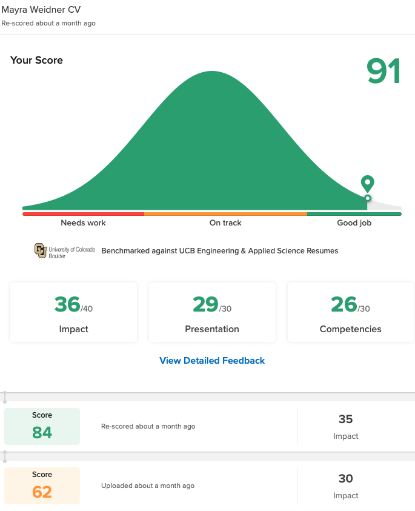
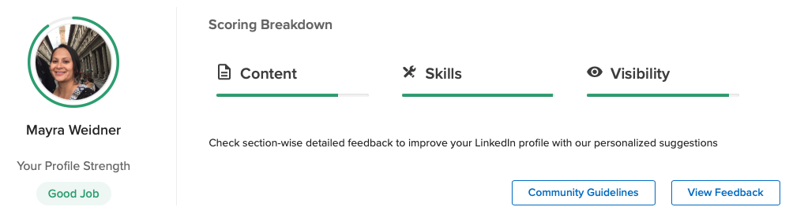
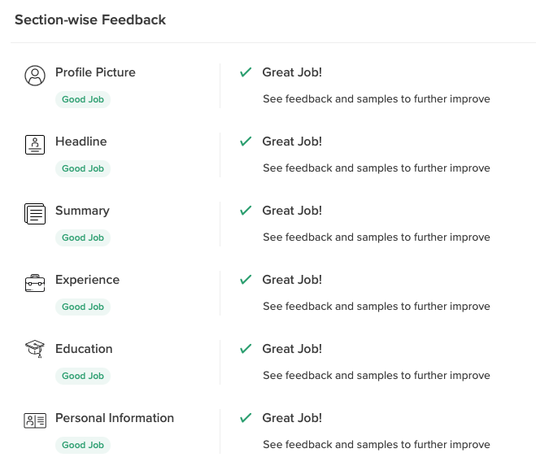

<!---
layout: page
title: "VMock Resume and LinkedIn Improvement Resource"
permalink: /vmock
--->

## VMock: Excellent Resource for Resume and LinkedIn Optimization
VMock is an AI driven platform for students and professionals that provides feedback on resumes and LinkedIn profiles. 

User profiles are evaluated on 100+ parameters including language, skills/competencies, and presentation. Students are allowed 10 free resume critiques with their CU Identikey.

### Personal Experience
I used VMock recently to improve my resume. I uploaded my resume as a pdf and the AI gave me a score of 62 out of 100. VMock provided content specific feedback. Most of my issues stemmed from the overuse of common verbs and the lack of quantifiable impact in my work experience section. In other words, I needed to sell my experience in such a way that a potential employer could glean the full impact of my work.

I reworked my resume and uploaded it to VMock again. This time my score improved by 22 points. The only feedback that I was given was to continue to improve the specifics in my work experience section.

I Googled examples to help me structure my bullets and resubmitted my resume to VMock. This time my score improved to 91!

I also used VMock to improve my LinkedIn profile which admittedly was very sparse. VMock doesn't give a score for LinkedIn profiles. Instead, it gives a rating in the form of a pie graph and color coding.

To use this feature in VMock, upload a pdf of your LinkedIn profile. To download your LinkedIn profile, go to your profile then click "More". 

VMock breaks down each section in your profile and grades it based on content, skills, and visibility. Most of the suggested changes were related to overuse of verbs and the lack of keywords that would drive more traffic to my profile. I also had to change my photo because VMock felt it was too dark.

The most difficult part was writing my headline. I took VMock's advice, but also Googled examples. The key is to highlight your skills that can be useful in the job you aspire to get. I worked on my profile until VMock showed green in every category. Since my profile was pretty sparse, it took about 3 hours.

[My LinkedIn Profile](https://www.linkedin.com/in/mayra-weidner/)

### What Did I Learn?
I learned that I need to sell my skills better. My background is in accounting which translates well to software engineering and computer science in general, but I did not make that abundantly clear in my resume or LinkedIn profile. VMock is an easy tool that pointed out deficiencies in my resume that I did not see after multiple reads. I had a few people review my resume prior to using VMock and the feedback was not as thorough.

I recommend this tool for any student that wants their resume to stand out amongst the stack of 100's of other recent graduates with the same GPA. 

### Other Links
[Project](./project)

[Weekly Project Updates](./updates)

[Coding Notes](./codingnotes)

[Final Project Report](./final)

[Home](./)
